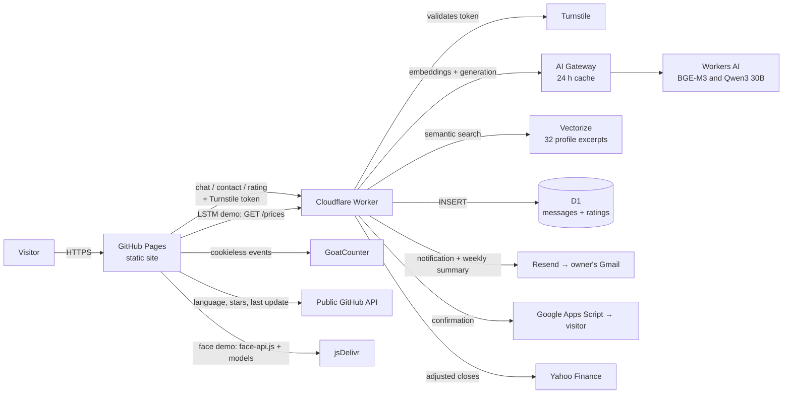

# Emanuel Borges — Portfolio

🌐 **English** · [Português](README.pt-BR.md)

[](https://github.com/emanueleborges/emanueleborges.github.io/actions/workflows/testes.yml)

Professional portfolio of **Emanuel Borges**, Senior Full Stack Developer (Java/Kotlin, Node.js, React, React Native) specializing in **applied AI (Machine Learning and NLP)**.

🔗 **Live site:** https://emanueleborges.github.io · 💬 **Ask the assistant:** https://emanueleborges.github.io/#chat

🧪 **Live AI demos:** [stock forecasting (LSTM)](https://emanueleborges.github.io/demos/lstm/) · [face recognition](https://emanueleborges.github.io/demos/face/) · [movie recommender](https://emanueleborges.github.io/demos/filmes/)

A framework-free static site with a serverless backend on Cloudflare for the AI chat and the contact form, plus **3 AI demos that run in the visitor's browser**. **The whole infrastructure runs on free tiers.**

---

## Contents

- [Features](#features)
- [Architecture](#architecture)
- [Tech stack](#tech-stack)
- [Project structure](#project-structure)
- [Running locally](#running-locally)
- [Deployment](#deployment)
- [Common tasks](#common-tasks)
- [Quality and testing](#quality-and-testing)
- [Security and privacy](#security-and-privacy)
- [Costs](#costs)
- [Specification (SDD)](#specification-sdd)
- [Credits](#credits)

---

## Features

| Area | What it does |
|---|---|
| **8 languages** | English (default), Portuguese, Spanish, French, Italian, German, Chinese and Russian. Visitors pick one in the header; the choice is remembered and can come in the link (`?lang=pt`). |
| **Sections** | About (with photo), Experience, Projects (10 cards, 4 with a live demo; filters, a link to the code and language/stars/last update from the GitHub API), Skills (45 technologies with icons and filters), Education (with institution logos) and Contact. |
| **Visuals** | Dark purple + cyan theme, moving duotone background images, Canvas particle network, scroll animations and a sticky header with reading progress. Respects "reduce motion". |
| **AI assistant** | Hybrid: local **ready-made answers** for frequent questions, **generative AI with RAG** for everything else and **local search** as a fallback. AI answers can be rated 👍/👎. See [Architecture](#architecture). |
| **PDF résumé** | One PDF per language, generated from the same text source as the site; the button downloads the PDF for the current language. |
| **Contact form** | Messages stored in D1, invisible bot protection, **email notification** to the owner and an **automatic confirmation** to the visitor in the language of their message. |
| **Direct contacts** | Email, WhatsApp, LinkedIn and GitHub. |
| **SEO** | Link previews (Open Graph/Twitter), `hreflang` for 8 languages, `Person` structured data (JSON-LD), `sitemap.xml` and `robots.txt`; verified in Google Search Console. |
| **Analytics** | Visits and events (chat opened, résumé downloads, contact clicks, form submissions, ratings) with GoatCounter, cookieless. |
| **Weekly summary** | Every Monday an email with the week's messages, chat ratings and a health check of the AI, vector index and database. |
| **404 page** | Custom page in the site's style with links to the portfolio and the assistant. |
| **AI demo: LSTM stock forecasting** | `/demos/lstm/` page (8 languages) where the FIAP project's LSTM runs **in the browser, in plain JavaScript** (weights exported from Keras, same output to ~1e-8). Recent prices come from the Worker (Yahoo Finance), with a saved copy if it fails; test metrics compared against a naive baseline. |
| **AI demo: face recognition** | `/demos/face/` page with face-api.js (TensorFlow.js): detection, 128-number embeddings and recognition via webcam or photo. **Nothing leaves** the visitor's device. |
| **AI demo: movie recommender** | `/demos/filmes/` page: TF-IDF + cosine in plain JavaScript over ~1,500 films (Wikidata CC0 + Wikipedia CC BY-SA summaries), by film or free description, showing the terms behind each recommendation. |
| **Installable app (PWA)** | Can be installed on a phone or computer (own icon) and opens offline: the page and its files are saved by a *service worker*. |

---

## Architecture



The **AI demos** run inference in the browser: the LSTM runs in plain JavaScript with weights exported from Keras, face recognition uses face-api.js (TensorFlow.js) and the movie recommender computes TF-IDF + cosine in JS. The service worker (`sw.js`) keeps the site available offline.

### How the assistant answers

1. **Contact and résumé** → contact buttons or the PDF link (local).
2. **Ready-made answers** (19 topics, 8 languages) → greetings, thanks, salary, start date and **education** are **always answered locally**, at no cost and with verified text. Other ready-made topics (roles sought, remote work, AI, technologies…) are answered by the AI when it is available.
3. **AI with RAG** → the Worker:
   1. validates the **Turnstile** token;
   2. embeds the question with **BGE-M3** (multilingual);
   3. retrieves from **Vectorize** the 6 profile excerpts closest in meaning;
   4. sends **Qwen3 30B** a fixed profile summary + those excerpts, with rules to answer only about the profile and never invent facts;
   5. caches the answer in **AI Gateway** for 24 h (key = knowledge version + language + normalized question).
4. **Local search** (fallback) → if the AI fails or the daily quota runs out, the chat searches the page content itself: TF-IDF-style ranking, typo tolerance (Damerau-Levenshtein), synonyms and Chinese handling.

The AI knowledge is **generated from the site's own translations** (`i18n.js`): when the site changes and the Worker is deployed, the AI and the vector index follow.

---

## Tech stack

**Front-end:** semantic HTML5 · CSS3 (no framework) · vanilla JavaScript (ES2020+) · Canvas 2D · IntersectionObserver · Fetch API · `Intl` · `localStorage`

**Serverless backend (Cloudflare free tier):** Workers · Cron Triggers · Workers AI (`@cf/qwen/qwen3-30b-a3b-fp8`, `@cf/baai/bge-m3`) · Vectorize · AI Gateway · D1 (SQLite) · Turnstile · Rate Limiting · Wrangler

**AI in the demos:** Keras/TensorFlow (LSTM training) · plain-JavaScript LSTM (inference) · face-api.js 1.7.15 / TensorFlow.js (WebGL) · TF-IDF + cosine similarity in JS · SVG charts

**PWA:** Web App Manifest · Service Worker (network first for the page, cache for files)

**Email:** Resend (owner notifications and weekly summary) · Google Apps Script (visitor confirmations from Gmail)

**Tooling:** Git + GitHub · GitHub Pages · GitHub Actions · GitHub CLI · headless Chrome (PDFs and tests) · Lighthouse and Lighthouse CI · Node.js · Python · Shell · GoatCounter

**External assets:** Google Fonts (Manrope, DM Mono) · Simple Icons (CC0) · Unsplash · public GitHub API · Yahoo Finance · Wikidata and Wikipedia · jsDelivr

---

## Project structure

```
.
├── index.html              # Single-page portfolio (SEO, Open Graph, JSON-LD)
├── 404.html                # Custom "page not found"
├── manifest.webmanifest · sw.js · icon-*.png  # Installable, offline app (PWA)
├── demos/                  # In-browser AI demos (shared demos.css/demos.js)
│   ├── lstm/               # Stock forecasting: lstm.js (inference), weights and data
│   ├── face/               # Face recognition with face-api.js
│   └── filmes/             # Movie recommender: tfidf.js and filmes.json
├── scripts/gerar-dados-filmes.py  # Builds demos/filmes/filmes.json (Wikidata + Wikipedia)
├── scripts/lstm/           # Training (train.py) and export (exportar_web.py) of the demo's LSTM
├── styles.css              # All styling (theme, layout, animations, chat, form)
├── i18n.js                 # Text in 8 languages (site, chat, form and résumé)
├── script.js               # Languages, menu, filters, animations, particles, analytics
├── api.js                  # Shared connection to the Worker and Turnstile
├── chat.js                 # Assistant: ready-made answers, local search, AI and ratings
├── contact.js              # Contact form
├── curriculo.html          # A4 résumé template used to generate the PDFs
├── gerar-curriculos.sh     # Generates the 8 PDFs in cv/ with headless Chrome
├── sitemap.xml · robots.txt · og-image.jpg
├── cv/                     # PDF résumés (one per language)
├── logos/                  # Institution logos and skill icons
├── tests/                  # Automated chat tests (92 cases, 8 languages)
├── .github/workflows/      # GitHub Actions: tests and Lighthouse on every push
├── lighthouserc.json       # Minimum Lighthouse scores in CI
├── scripts/pre-commit      # Git hook: last-updated date and file versioning
├── apps-script/Codigo.gs   # Visitor confirmation (Google Apps Script) — template without the secret
├── docs/sdd/               # Specification (SDD) in Portuguese; docs/sdd/en/ in English
└── worker/                 # Cloudflare Worker
    ├── src/index.js            # POST / (chat), /contact, /feedback, GET /prices (LSTM demo) + weekly Cron
    ├── src/conhecimento.js     # Generated: summary, excerpts, full profile, version
    ├── gerar-conhecimento.mjs  # Builds the AI knowledge from i18n.js
    ├── indexar-vectorize.mjs   # Generates embeddings and updates the Vectorize index
    ├── migrations/             # D1 schema (messages, feedback)
    ├── ver-mensagens.sh        # Lists contact-form messages
    ├── ver-avaliacoes.sh       # 👍/👎 summary of chat answers
    └── wrangler.jsonc          # Config (AI, Vectorize, D1, limits, origin, cron)
```

---

## Running locally

There is no build step: just serve the folder.

```bash
git clone https://github.com/emanueleborges/emanueleborges.github.io.git
cd emanueleborges.github.io
python3 -m http.server 8000      # or any static server
# open http://localhost:8000
```

> Locally, the chat works with **ready-made answers and local search**. The AI, the contact form and ratings only accept requests from `https://emanueleborges.github.io` (CORS + Turnstile), by design.

Install the git hook (updates the footer date and the `?v=` version of CSS/JS on every commit):

```bash
cp scripts/pre-commit .git/hooks/pre-commit && chmod +x .git/hooks/pre-commit
```

### Worker (optional)

```bash
cd worker
npm install
npx wrangler login
npm run dev          # builds the knowledge and runs the Worker locally
```

---

## Deployment

**Site:** every `git push` to `main` deploys to GitHub Pages in 1–2 minutes (and runs the tests in GitHub Actions).

**Worker:**

```bash
cd worker
npm run deploy
```

This (1) builds the knowledge from `i18n.js`, (2) deploys the Worker and (3) updates the Vectorize index.

**Cloudflare resources** (created once):

| Resource | Name |
|---|---|
| Worker | `emanuel-portfolio-chat` (weekly cron: Mondays 12:00 UTC) |
| D1 database | `portfolio-contact` (tables `messages` and `feedback`) |
| Vectorize index | `portfolio-profile` (1024 dimensions, cosine) |
| AI Gateway | `default` |
| Turnstile widget | invisible, domain `emanueleborges.github.io` |
| Worker secrets | `TURNSTILE_SECRET`, `RESEND_API_KEY`, `APPS_SCRIPT_URL`, `APPS_SCRIPT_SECRET`, optional `GOATCOUNTER_TOKEN` |

**Visitor confirmation (Google Apps Script):** paste `apps-script/Codigo.gs` into a new Apps Script project with the same value as `APPS_SCRIPT_SECRET`, deploy it as a **Web app** (*Execute as: Me*, *Who has access: Anyone*) and store its `/exec` URL in the `APPS_SCRIPT_URL` secret.

---

## Common tasks

| I want to… | Do this |
|---|---|
| Change site text | Edit `index.html` (Portuguese) and `i18n.js` (other languages), then run `npm run deploy` in `worker/` so the AI learns it. |
| Update the PDF résumés | `./gerar-curriculos.sh` |
| Read contact-form messages | `cd worker && ./ver-mensagens.sh` (or `./ver-mensagens.sh 50`) — or Cloudflare dashboard: D1 → `portfolio-contact` → Console |
| See chat ratings 👍/👎 | `cd worker && ./ver-avaliacoes.sh` |
| See AI usage and cache | Cloudflare dashboard → **AI → AI Gateway → default** |
| See visits and events | https://emanueleborges.goatcounter.com |
| See Google searches and indexing | [Google Search Console](https://search.google.com/search-console) → property `https://emanueleborges.github.io/` |
| Run the chat tests | `./tests/rodar-testes-chat.sh` |
| Run Lighthouse like CI does | `npx @lhci/cli@0.15.1 autorun` (uses `lighthouserc.json`) |
| Refresh the movie data | `python3 scripts/gerar-dados-filmes.py` (~2 min) |
| Retrain the demo's LSTM | `pip install -r scripts/lstm/requirements.txt` → `python scripts/lstm/train.py` → `python scripts/lstm/exportar_web.py demos/lstm` |
| Add a stock to the LSTM demo | Add the ticker to `TICKERS` (`scripts/lstm/train.py`) and `PRICE_SYMBOLS` (`worker/src/index.js`); retrain, export and run `npm run deploy` in `worker/` |

---

## Quality and testing

| Check | Result |
|---|---|
| **GitHub Actions** on every push | JavaScript syntax, `sitemap.xml` and JSON-LD validation, AI knowledge build and the **92 chat tests** |
| **Lighthouse (mobile)** | Performance ~80 · Accessibility 100 · Best practices 100 · SEO 100 |
| **Lighthouse in CI** on every push | 3 runs; fails if accessibility < 95, best practices < 90 or SEO < 95 (performance < 70 only warns). The report link appears in the GitHub Actions log. |
| **Worker** | Wrong origin, invalid fields, missing/fake token, unknown route, per-minute limits, honeypot and `GET /prices` (unlisted stock and other origins rejected) |
| **AI demos** | JS LSTM checked against Keras (difference ~1e-8); the face demo recognizes a mirrored, rotated photo (distance 0.19); the movie demo indexes ~1,500 films in < 50 ms; all three tested in Chrome (desktop and mobile, several languages) and on the live site |
| **Offline** | With the service worker active, the page reloads offline, with its look and projects |
| **End-to-end** | Questions, ratings and form submissions on the live site in a real Chrome window (Turnstile rejects invisible automated browsers, as expected) |

---

## Security and privacy

- **CORS:** the Worker only accepts requests from `https://emanueleborges.github.io`.
- **Turnstile:** every AI question, form submission and rating requires a valid bot-protection token.
- **Prices route (`GET /prices`):** read-only; only accepts the site's origin and the demo's 3 stocks, with a per-IP limit and a 1 h cache.
- **External script integrity (SRI):** the face demo's face-api.js has an `integrity` (SHA-384) attribute; if the CDN file is altered, the browser won't run it.
- **HTTPS enforced** with HSTS (GitHub Pages).
- **Accounts:** the most important protection is two-factor authentication (2FA) on GitHub, Cloudflare, Google and Resend.
- **Per-IP limits:** 10 questions/min (chat), 3 messages/min (form), 20 ratings/min, 30 price lookups/min. Cloudflare's limiter is permissive (counters lag slightly): it stops high-volume abuse, not an exact request count.
- **Validation:** question ≤ 500 characters; name 2–100, valid email ≤ 200, message 5–2,000.
- **Honeypot** field in the form: bot submissions are dropped without being saved.
- **AI restricted to the profile:** instructions to answer only about the professional profile, never invent facts and ignore attempts to change the rules.
- **Visitor confirmation can't be abused as spam:** no message text echoed, first name only (letters), at most one confirmation per email address every 24 h.
- **No secrets in the code:** all keys are Worker secrets; the Turnstile site key is public by design.
- **Privacy (LGPD/GDPR-style):** the form stores only name, email, message, language and date (no IP address); analytics are cookieless; the chat discloses when a question goes to the AI; questions and answers are stored only if the visitor rates them, with a notice next to the buttons.
- **Face demo:** camera and photos are processed only on the visitor's device; nothing is sent or stored, and registered faces disappear when the page closes.

---

## Costs

**Zero.** Everything runs on free tiers:

| Service | Use |
|---|---|
| [GitHub Pages](https://pages.github.com) · [GitHub Actions](https://github.com/features/actions) | Hosting and CI (public repository) |
| [Cloudflare Workers](https://workers.cloudflare.com) | Backend and weekly cron (~100k requests/day free) |
| [Workers AI](https://developers.cloudflare.com/workers-ai/) | AI and embeddings (10,000 "neurons"/day free; hundreds of questions/day) |
| [Vectorize](https://developers.cloudflare.com/vectorize/), [D1](https://developers.cloudflare.com/d1/), [AI Gateway](https://developers.cloudflare.com/ai-gateway/), [Turnstile](https://www.cloudflare.com/application-services/products/turnstile/) | Free tiers |
| [Resend](https://resend.com) | Notifications and weekly summary (3,000 emails/month free) |
| [Google Apps Script](https://developers.google.com/apps-script) | Visitor confirmations from Gmail (~100/day) |
| [GoatCounter](https://www.goatcounter.com) | Free for personal use |
| AI demos | Run in the visitor's browser; face-api.js models via [jsDelivr](https://www.jsdelivr.com) (free CDN); prices via the Worker; static movie data |
| [GitHub API](https://docs.github.com/en/rest) · [Yahoo Finance](https://finance.yahoo.com) · [Wikidata](https://www.wikidata.org)/[Wikipedia](https://www.wikipedia.org) | Public and free (no key) |

If the daily AI quota runs out, the chat keeps working with local search until it resets (00:00 UTC).

### Zero-cost rules

> ⚠️ This project **must not generate any cost**. Verified on 2026-10-10: Cloudflare on the **Workers Free** plan and **no card on file** in any service.

1. **Never add a card** or any other payment method (Cloudflare, Resend, Google, GitHub, GoatCounter).
2. **Ignore** "Upgrade", "Workers Paid", "Add payment method" and similar buttons.
3. Without a payment method, **no service can charge**: when a free limit is reached, the feature **pauses** (e.g. Workers AI returns error 3036 and the chat falls back to local search) and resumes the next day.
4. Before adding any new service, confirm it has a **free plan with no card required** and what happens when the limit is exceeded.
5. Check occasionally: Cloudflare → **Billing** (*Workers Free* plan, no payment method) and Resend → **Settings → Billing** (*Free* plan).

---

## Specification (SDD)

The project follows **Spec-Driven Development**: the specification describes the *what* and *why* before the *how*.

| Document | English | Português |
|---|---|---|
| Specification — vision, requirements and acceptance criteria | [spec.md](docs/sdd/en/spec.md) | [spec.md](docs/sdd/spec.md) |
| Technical plan — architecture, API contracts, data and decisions (ADRs) | [plan.md](docs/sdd/en/plan.md) | [plan.md](docs/sdd/plan.md) |
| Tasks — done and pending | [tasks.md](docs/sdd/en/tasks.md) | [tasks.md](docs/sdd/tasks.md) |

---

## Credits

- Technology icons: [Simple Icons](https://simpleicons.org) (CC0) — see `logos/skills/LICENSE-simple-icons.md`. Oracle, SQL Server and AWS use generic icons per brand guidelines.
- UFG, FIAP, Descomplica and FUCAPI logos: taken from the official websites, used only to identify the education.
- Background images: [Unsplash](https://unsplash.com).
- Fonts: Manrope and DM Mono (Google Fonts).
- Face demo: [face-api.js](https://github.com/vladmandic/face-api) (MIT), by Vladimir Mandic.
- Movie demo: data from [Wikidata](https://www.wikidata.org) (CC0) and shortened English [Wikipedia](https://en.wikipedia.org) summaries (CC BY-SA 4.0).
- LSTM demo: prices from [Yahoo Finance](https://finance.yahoo.com), used for demonstration only.

---

**Author:** Emanuel Borges · [LinkedIn](https://www.linkedin.com/in/borgesemmanuell) · [GitHub](https://github.com/emanueleborges) · emanuel.eborges@gmail.com
