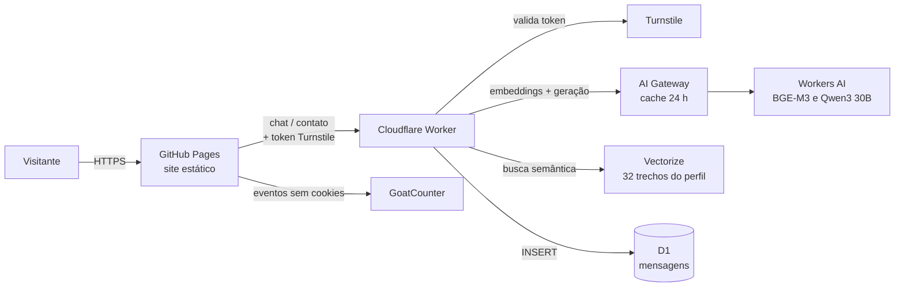

# Emanuel Borges — Portfólio

Portfólio profissional de **Emanuel Borges**, Desenvolvedor Full Stack Sênior (Java/Kotlin, Node.js, React, React Native) especializando-se em **IA aplicada (Machine Learning e NLP)**.

🔗 **Site:** https://emanueleborges.github.io

O projeto é um site estático, sem framework, com um backend *serverless* no Cloudflare para o chat com IA e o formulário de contato. **Toda a infraestrutura roda em planos gratuitos.**

---

## Sumário

- [Funcionalidades](#funcionalidades)
- [Arquitetura](#arquitetura)
- [Tecnologias](#tecnologias)
- [Estrutura do projeto](#estrutura-do-projeto)
- [Como rodar localmente](#como-rodar-localmente)
- [Publicação](#publicação)
- [Tarefas comuns](#tarefas-comuns)
- [Testes](#testes)
- [Segurança e privacidade](#segurança-e-privacidade)
- [Custos](#custos)
- [Documentação de especificação (SDD)](#documentação-de-especificação-sdd)
- [Créditos](#créditos)

---

## Funcionalidades

| Área | O que faz |
|---|---|
| **7 idiomas** | Inglês (padrão), português, espanhol, francês, italiano, chinês e russo. O visitante escolhe no cabeçalho; a escolha fica salva e pode vir no link (`?lang=pt`). |
| **Seções** | Sobre (com foto), Experiência, Projetos (com filtros), Habilidades (45 tecnologias com ícones e filtros), Formação (com logos das instituições) e Contato. |
| **Visual** | Tema escuro roxo + ciano, imagens de fundo em movimento (duotone), rede de partículas em Canvas, animações ao rolar e cabeçalho fixo com barra de progresso. Respeita a preferência "reduzir movimento". |
| **Assistente (chat)** | Híbrido: **respostas prontas** locais para perguntas frequentes, **IA generativa com RAG** para o resto e **busca local** como reserva. Mais detalhes em [Arquitetura](#arquitetura). |
| **Currículo em PDF** | Um PDF por idioma, gerado da mesma fonte de traduções do site; o botão baixa o PDF do idioma atual. |
| **Formulário de contato** | Mensagens salvas num banco D1, com proteção anti-robô invisível e **aviso por e-mail** a cada mensagem nova (Resend, gratuito). |
| **Contatos diretos** | E-mail, WhatsApp, LinkedIn e GitHub. |
| **Estatísticas** | Visitas e eventos (abertura do chat, downloads do currículo, cliques em contatos, envios do formulário) com GoatCounter, sem cookies. |

---

## Arquitetura



### Como o chat decide a resposta

1. **Contato e currículo** → botões de contato ou link do PDF (local).
2. **Respostas prontas** (19 temas, nos 7 idiomas) → saudação, agradecimento, salário, data de início e **formação** respondem **sempre localmente**, sem custo e com texto conferido. Os demais temas prontos (tipo de vaga, remoto, IA, tecnologias…) são respondidos pela IA quando ela está disponível.
3. **IA com RAG** → o Worker:
   1. confere o token do **Turnstile**;
   2. gera o vetor da pergunta com **BGE-M3** (multilíngue);
   3. busca no **Vectorize** os 6 trechos do perfil mais parecidos em significado;
   4. envia ao **Qwen3 30B** um resumo fixo do perfil + esses trechos, com regras para responder só sobre o perfil e não inventar dados;
   5. guarda a resposta no **AI Gateway** por 24 h (chave = versão do conhecimento + idioma + pergunta normalizada).
4. **Busca local** (reserva) → se a IA falhar ou a cota do dia acabar, o chat procura no próprio conteúdo da página: ranking estilo TF-IDF, correção de digitação (Damerau-Levenshtein), sinônimos e tratamento de chinês.

O conhecimento da IA é **gerado das próprias traduções do site** (`i18n.js`): ao mudar o site e publicar o Worker, a IA e o índice vetorial acompanham.

---

## Tecnologias

**Front-end:** HTML5 semântico · CSS3 (sem framework) · JavaScript puro (ES2020+) · Canvas 2D · IntersectionObserver · Fetch API · `Intl` · `localStorage`

**Backend serverless (Cloudflare, plano gratuito):** Workers · Workers AI (`@cf/qwen/qwen3-30b-a3b-fp8`, `@cf/baai/bge-m3`) · Vectorize · AI Gateway · D1 (SQLite) · Turnstile · Rate Limiting · Wrangler

**Ferramentas:** Git + GitHub · GitHub Pages · GitHub CLI · Chrome headless (PDFs e testes) · Node.js · Python · Shell · GoatCounter

**Recursos externos:** Google Fonts (Manrope, DM Mono) · Simple Icons (CC0) · Unsplash

---

## Estrutura do projeto

```
.
├── index.html              # Página única do portfólio
├── styles.css              # Todo o visual (tema, layout, animações, chat, formulário)
├── i18n.js                 # Textos dos 7 idiomas (site, chat, formulário e currículo)
├── script.js               # Idiomas, menu, filtros, animações, partículas, estatísticas
├── api.js                  # Conexão com o Worker e o Turnstile (compartilhada)
├── chat.js                 # Assistente: respostas prontas, busca local e IA
├── contact.js              # Formulário de contato
├── curriculo.html          # Modelo do currículo (A4) usado para gerar os PDFs
├── gerar-curriculos.sh     # Gera os 7 PDFs em cv/ com Chrome headless
├── cv/                     # Currículos em PDF (um por idioma)
├── logos/                  # Logos das instituições e ícones das habilidades
├── tests/                  # Testes automáticos do chat (79 casos, 7 idiomas)
├── scripts/pre-commit      # Hook do git: data de atualização e versão dos arquivos
├── docs/sdd/               # Especificação (SDD) em português; docs/sdd/en/ em inglês
└── worker/                 # Cloudflare Worker (chat com IA + formulário)
    ├── src/index.js            # Rotas POST / (chat) e POST /contact
    ├── src/conhecimento.js     # Gerado: resumo, trechos e perfil completo
    ├── gerar-conhecimento.mjs  # Gera o conhecimento da IA a partir do i18n.js
    ├── indexar-vectorize.mjs   # Gera embeddings e atualiza o índice Vectorize
    ├── migrations/             # Esquema do banco D1
    ├── ver-mensagens.sh        # Lista as mensagens do formulário
    └── wrangler.jsonc          # Configuração (IA, Vectorize, D1, limites, origem)
```

---

## Como rodar localmente

O site não tem etapa de build: basta servir a pasta.

```bash
git clone https://github.com/emanueleborges/emanueleborges.github.io.git
cd emanueleborges.github.io
python3 -m http.server 8000      # ou qualquer servidor estático
# abra http://localhost:8000
```

> Em ambiente local, o chat funciona com **respostas prontas e busca local**. A IA e o formulário só aceitam pedidos vindos de `https://emanueleborges.github.io` (CORS + Turnstile), por segurança.

Para instalar o hook do git (atualiza a data do rodapé e a versão dos arquivos a cada commit):

```bash
cp scripts/pre-commit .git/hooks/pre-commit && chmod +x .git/hooks/pre-commit
```

### Worker (opcional)

```bash
cd worker
npm install
npx wrangler login
npm run dev          # gera o conhecimento e roda o Worker localmente
```

---

## Publicação

**Site:** cada `git push` na branch `main` publica no GitHub Pages em 1–2 minutos.

**Worker:**

```bash
cd worker
npm run deploy
```

Esse comando (1) gera o conhecimento a partir do `i18n.js`, (2) publica o Worker e (3) atualiza o índice do Vectorize.

**Recursos do Cloudflare usados** (criados uma vez):

| Recurso | Nome |
|---|---|
| Worker | `emanuel-portfolio-chat` |
| Banco D1 | `portfolio-contact` (tabela `messages`) |
| Índice Vectorize | `portfolio-profile` (1024 dimensões, cosseno) |
| AI Gateway | `default` |
| Widget Turnstile | invisível, domínio `emanueleborges.github.io` |
| Secrets do Worker | `TURNSTILE_SECRET`, `RESEND_API_KEY` |

---

## Tarefas comuns

| Quero… | Faça |
|---|---|
| Mudar um texto do site | Edite `index.html` (português) e `i18n.js` (demais idiomas). Depois publique o Worker (`npm run deploy` em `worker/`) para a IA aprender. |
| Atualizar os currículos em PDF | `./gerar-curriculos.sh` |
| Ler as mensagens do formulário | `cd worker && ./ver-mensagens.sh` (ou `./ver-mensagens.sh 50`) — ou no painel: D1 → `portfolio-contact` → Console |
| Ver uso da IA e do cache | Painel do Cloudflare → **AI → AI Gateway → default** |
| Ver visitas e eventos | https://emanueleborges.goatcounter.com |
| Rodar os testes do chat | `./tests/rodar-testes-chat.sh` |

---

## Testes

- **Chat (79 casos, 7 idiomas):** `./tests/rodar-testes-chat.sh` abre o site no Chrome headless e confere respostas prontas, busca local, correção de digitação, sinônimos e prioridade entre temas.
- **Worker:** validado com testes de origem, campos inválidos, limite por minuto, Turnstile ausente ou falso e campo-armadilha.
- **Ponta a ponta:** perguntas e envio do formulário no site publicado, numa janela real do Chrome (o Turnstile bloqueia navegadores automatizados invisíveis, como esperado).

---

## Segurança e privacidade

- **CORS:** o Worker só aceita pedidos de `https://emanueleborges.github.io`.
- **Turnstile:** toda pergunta à IA e todo envio do formulário exigem um token anti-robô válido.
- **Limites por IP:** 10 perguntas/minuto no chat e 3 mensagens/minuto no formulário.
- **Validação:** pergunta ≤ 500 caracteres; nome 2–100, e-mail válido ≤ 200, mensagem 5–2.000.
- **Campo-armadilha** no formulário: envios de robôs são descartados sem salvar.
- **IA restrita ao perfil:** instruções para responder só sobre o perfil profissional, não inventar dados e ignorar tentativas de mudar as regras.
- **Sem segredos no código:** a chave secreta do Turnstile fica como *secret* no Cloudflare; a chave pública (site key) é pública por natureza.
- **LGPD:** o formulário guarda apenas nome, e-mail, mensagem, idioma e data (o IP não é salvo); as estatísticas não usam cookies; o chat avisa quando a pergunta é enviada à IA.

---

## Custos

**Zero.** Tudo roda em planos gratuitos:

| Serviço | Uso no projeto |
|---|---|
| GitHub Pages | Hospedagem do site |
| Cloudflare Workers | Backend (~100 mil requisições/dia grátis) |
| Workers AI | IA e embeddings (10.000 "neurônios"/dia grátis; ~centenas de perguntas/dia) |
| Vectorize, D1, AI Gateway, Turnstile | Planos gratuitos |
| Resend | Aviso por e-mail (3.000/mês grátis) |
| GoatCounter | Plano gratuito para uso pessoal |

Se a cota diária da IA acabar, o chat continua funcionando com a busca local até a renovação (00:00 UTC).

---

## Documentação de especificação (SDD)

O projeto segue **Spec-Driven Development**: a especificação descreve o *quê* e o *porquê* antes do *como*.

| Documento | Português | English |
|---|---|---|
| Especificação — visão, requisitos e critérios de aceite | [spec.md](docs/sdd/spec.md) | [spec.md](docs/sdd/en/spec.md) |
| Plano técnico — arquitetura, contratos de API, dados e decisões (ADRs) | [plan.md](docs/sdd/plan.md) | [plan.md](docs/sdd/en/plan.md) |
| Tarefas — concluídas e pendentes | [tasks.md](docs/sdd/tasks.md) | [tasks.md](docs/sdd/en/tasks.md) |

---

## Créditos

- Ícones das tecnologias: [Simple Icons](https://simpleicons.org) (CC0) — ver `logos/skills/LICENSE-simple-icons.md`. Oracle, SQL Server e AWS usam ícones genéricos por diretriz de marca.
- Logos de UFG, FIAP, Descomplica e FUCAPI: obtidos dos sites oficiais, usados apenas para identificar a formação.
- Imagens de fundo: [Unsplash](https://unsplash.com).
- Fontes: Manrope e DM Mono (Google Fonts).

---

**Autor:** Emanuel Borges · [LinkedIn](https://www.linkedin.com/in/borgesemmanuell) · [GitHub](https://github.com/emanueleborges) · emanuel.eborges@gmail.com
