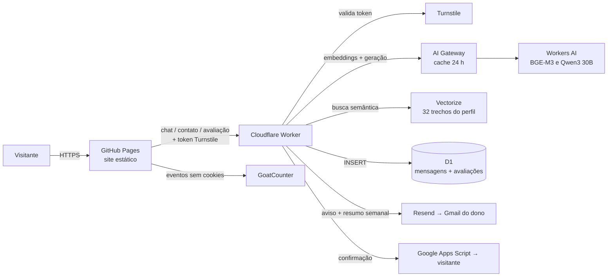

# Emanuel Borges — Portfólio

🌐 [English](README.md) · **Português**

[](https://github.com/emanueleborges/emanueleborges.github.io/actions/workflows/testes.yml)

Portfólio profissional de **Emanuel Borges**, Desenvolvedor Full Stack Sênior (Java/Kotlin, Node.js, React, React Native) especializando-se em **IA aplicada (Machine Learning e NLP)**.

🔗 **Site:** https://emanueleborges.github.io · 💬 **Pergunte ao assistente:** https://emanueleborges.github.io/#chat

Site estático, sem framework, com um backend *serverless* no Cloudflare para o chat com IA e o formulário de contato. **Toda a infraestrutura roda em planos gratuitos.**

---

## Sumário

- [Funcionalidades](#funcionalidades)
- [Arquitetura](#arquitetura)
- [Tecnologias](#tecnologias)
- [Estrutura do projeto](#estrutura-do-projeto)
- [Como rodar localmente](#como-rodar-localmente)
- [Publicação](#publicação)
- [Tarefas comuns](#tarefas-comuns)
- [Qualidade e testes](#qualidade-e-testes)
- [Segurança e privacidade](#segurança-e-privacidade)
- [Custos](#custos)
- [Especificação (SDD)](#especificação-sdd)
- [Créditos](#créditos)

---

## Funcionalidades

| Área | O que faz |
|---|---|
| **8 idiomas** | Inglês (padrão), português, espanhol, francês, italiano, alemão, chinês e russo. O visitante escolhe no cabeçalho; a escolha fica salva e pode vir no link (`?lang=pt`). |
| **Seções** | Sobre (com foto), Experiência, Projetos (com filtros, link para o código e linguagem/estrelas/última atualização vindos da API do GitHub), Habilidades (45 tecnologias com ícones e filtros), Formação (com logos das instituições) e Contato. |
| **Visual** | Tema escuro roxo + ciano, imagens de fundo em movimento (duotone), rede de partículas em Canvas, animações ao rolar e cabeçalho fixo com barra de progresso. Respeita "reduzir movimento". |
| **Assistente com IA** | Híbrido: **respostas prontas** locais para perguntas frequentes, **IA generativa com RAG** para o resto e **busca local** como reserva. Respostas da IA podem ser avaliadas com 👍/👎. Veja [Arquitetura](#arquitetura). |
| **Currículo em PDF** | Um PDF por idioma, gerado da mesma fonte de textos do site; o botão baixa o PDF do idioma atual. |
| **Formulário de contato** | Mensagens salvas no D1, proteção anti-robô invisível, **aviso por e-mail** ao dono e **confirmação automática** ao visitante no idioma da mensagem. |
| **Contatos diretos** | E-mail, WhatsApp, LinkedIn e GitHub. |
| **SEO** | Prévia de link (Open Graph/Twitter), `hreflang` para os 8 idiomas, dados estruturados de `Person` (JSON-LD), `sitemap.xml` e `robots.txt`; verificado no Google Search Console. |
| **Estatísticas** | Visitas e eventos (chat aberto, downloads do currículo, cliques em contatos, envios do formulário, avaliações) com GoatCounter, sem cookies. |
| **Resumo semanal** | Toda segunda, um e-mail com as mensagens da semana, as avaliações do chat e um teste de saúde da IA, do índice vetorial e do banco. |
| **Página 404** | Página personalizada no estilo do site, com links para o portfólio e o assistente. |
| **Demo de IA: previsão de ações com LSTM** | Página `/demos/lstm/` (8 idiomas) onde o LSTM do projeto FIAP roda **no navegador, em JavaScript puro** (pesos exportados do Keras, mesma saída até ~1e-8). Preços recentes pelo Worker (Yahoo Finance), com cópia salva se ele falhar; métricas do teste comparadas com um baseline ingênuo. |
| **App instalável (PWA)** | Pode ser instalado no celular ou computador (ícone próprio) e abre sem internet: a página e os arquivos ficam salvos pelo *service worker*. |

---

## Arquitetura



### Como o assistente responde

1. **Contato e currículo** → botões de contato ou link do PDF (local).
2. **Respostas prontas** (19 temas, 8 idiomas) → saudação, agradecimento, salário, data de início e **formação** são **sempre locais**, sem custo e com texto conferido. Os demais temas prontos (tipo de vaga, remoto, IA, tecnologias…) são respondidos pela IA quando ela está disponível.
3. **IA com RAG** → o Worker:
   1. confere o token do **Turnstile**;
   2. gera o vetor da pergunta com **BGE-M3** (multilíngue);
   3. busca no **Vectorize** os 6 trechos do perfil mais parecidos em significado;
   4. envia ao **Qwen3 30B** um resumo fixo do perfil + esses trechos, com regras para responder só sobre o perfil e nunca inventar dados;
   5. guarda a resposta no **AI Gateway** por 24 h (chave = versão do conhecimento + idioma + pergunta normalizada).
4. **Busca local** (reserva) → se a IA falhar ou a cota do dia acabar, o chat procura no próprio conteúdo da página: ranking estilo TF-IDF, correção de digitação (Damerau-Levenshtein), sinônimos e tratamento de chinês.

O conhecimento da IA é **gerado das próprias traduções do site** (`i18n.js`): ao mudar o site e publicar o Worker, a IA e o índice vetorial acompanham.

---

## Tecnologias

**Front-end:** HTML5 semântico · CSS3 (sem framework) · JavaScript puro (ES2020+) · Canvas 2D · IntersectionObserver · Fetch API · `Intl` · `localStorage`

**Backend serverless (Cloudflare, plano gratuito):** Workers · Cron Triggers · Workers AI (`@cf/qwen/qwen3-30b-a3b-fp8`, `@cf/baai/bge-m3`) · Vectorize · AI Gateway · D1 (SQLite) · Turnstile · Rate Limiting · Wrangler

**E-mail:** Resend (avisos ao dono e resumo semanal) · Google Apps Script (confirmações ao visitante pelo Gmail)

**Ferramentas:** Git + GitHub · GitHub Pages · GitHub Actions · GitHub CLI · Chrome headless (PDFs e testes) · Lighthouse · Node.js · Python · Shell · GoatCounter

**Recursos externos:** Google Fonts (Manrope, DM Mono) · Simple Icons (CC0) · Unsplash

---

## Estrutura do projeto

```
.
├── index.html              # Página única do portfólio (SEO, Open Graph, JSON-LD)
├── 404.html                # "Página não encontrada" personalizada
├── manifest.webmanifest · sw.js · icon-*.png  # App instalável e offline (PWA)
├── demos/lstm/             # Demo do LSTM no navegador: página, lstm.js (inferência), pesos e dados
├── styles.css              # Todo o visual (tema, layout, animações, chat, formulário)
├── i18n.js                 # Textos dos 8 idiomas (site, chat, formulário e currículo)
├── script.js               # Idiomas, menu, filtros, animações, partículas, estatísticas
├── api.js                  # Conexão compartilhada com o Worker e o Turnstile
├── chat.js                 # Assistente: respostas prontas, busca local, IA e avaliações
├── contact.js              # Formulário de contato
├── curriculo.html          # Modelo do currículo (A4) usado para gerar os PDFs
├── gerar-curriculos.sh     # Gera os 8 PDFs em cv/ com Chrome headless
├── sitemap.xml · robots.txt · og-image.jpg
├── cv/                     # Currículos em PDF (um por idioma)
├── logos/                  # Logos das instituições e ícones das habilidades
├── tests/                  # Testes automáticos do chat (92 casos, 8 idiomas)
├── .github/workflows/      # GitHub Actions: testes e Lighthouse a cada push
├── lighthouserc.json       # Notas mínimas do Lighthouse no CI
├── scripts/pre-commit      # Hook do git: data de atualização e versão dos arquivos
├── apps-script/Codigo.gs   # Confirmação ao visitante (Google Apps Script) — modelo sem a senha
├── docs/sdd/               # Especificação (SDD) em português; docs/sdd/en/ em inglês
└── worker/                 # Cloudflare Worker
    ├── src/index.js            # POST / (chat), /contact, /feedback, GET /prices (demo LSTM) + Cron semanal
    ├── src/conhecimento.js     # Gerado: resumo, trechos, perfil completo e versão
    ├── gerar-conhecimento.mjs  # Gera o conhecimento da IA a partir do i18n.js
    ├── indexar-vectorize.mjs   # Gera embeddings e atualiza o índice Vectorize
    ├── migrations/             # Esquema do D1 (messages, feedback)
    ├── ver-mensagens.sh        # Lista as mensagens do formulário
    ├── ver-avaliacoes.sh       # Resumo das avaliações 👍/👎 do chat
    └── wrangler.jsonc          # Configuração (IA, Vectorize, D1, limites, origem, cron)
```

---

## Como rodar localmente

O site não tem etapa de build: basta servir a pasta.

```bash
git clone https://github.com/emanueleborges/emanueleborges.github.io.git
cd emanueleborges.github.io
python3 -m http.server 8000      # ou qualquer servidor estático
# abra http://localhost:8000
```

> Em ambiente local, o chat funciona com **respostas prontas e busca local**. A IA, o formulário e as avaliações só aceitam pedidos vindos de `https://emanueleborges.github.io` (CORS + Turnstile), por segurança.

Instale o hook do git (atualiza a data do rodapé e a versão `?v=` do CSS/JS a cada commit):

```bash
cp scripts/pre-commit .git/hooks/pre-commit && chmod +x .git/hooks/pre-commit
```

### Worker (opcional)

```bash
cd worker
npm install
npx wrangler login
npm run dev          # gera o conhecimento e roda o Worker localmente
```

---

## Publicação

**Site:** cada `git push` na `main` publica no GitHub Pages em 1–2 minutos (e roda os testes no GitHub Actions).

**Worker:**

```bash
cd worker
npm run deploy
```

Esse comando (1) gera o conhecimento a partir do `i18n.js`, (2) publica o Worker e (3) atualiza o índice do Vectorize.

**Recursos do Cloudflare** (criados uma vez):

| Recurso | Nome |
|---|---|
| Worker | `emanuel-portfolio-chat` (cron semanal: segundas 12:00 UTC) |
| Banco D1 | `portfolio-contact` (tabelas `messages` e `feedback`) |
| Índice Vectorize | `portfolio-profile` (1024 dimensões, cosseno) |
| AI Gateway | `default` |
| Widget Turnstile | invisível, domínio `emanueleborges.github.io` |
| Secrets do Worker | `TURNSTILE_SECRET`, `RESEND_API_KEY`, `APPS_SCRIPT_URL`, `APPS_SCRIPT_SECRET`, opcional `GOATCOUNTER_TOKEN` |

**Confirmação ao visitante (Google Apps Script):** cole `apps-script/Codigo.gs` num projeto novo do Apps Script com o mesmo valor do `APPS_SCRIPT_SECRET`, implante como **App da Web** (*Executar como: Eu*, *Quem pode acessar: Qualquer pessoa*) e guarde a URL `/exec` no secret `APPS_SCRIPT_URL`.

---

## Tarefas comuns

| Quero… | Faça |
|---|---|
| Mudar um texto do site | Edite `index.html` (português) e `i18n.js` (demais idiomas); depois rode `npm run deploy` em `worker/` para a IA aprender. |
| Atualizar os currículos em PDF | `./gerar-curriculos.sh` |
| Ler as mensagens do formulário | `cd worker && ./ver-mensagens.sh` (ou `./ver-mensagens.sh 50`) — ou no painel: D1 → `portfolio-contact` → Console |
| Ver as avaliações 👍/👎 do chat | `cd worker && ./ver-avaliacoes.sh` |
| Ver uso da IA e do cache | Painel do Cloudflare → **AI → AI Gateway → default** |
| Ver visitas e eventos | https://emanueleborges.goatcounter.com |
| Ver buscas e indexação no Google | [Google Search Console](https://search.google.com/search-console) → propriedade `https://emanueleborges.github.io/` |
| Rodar os testes do chat | `./tests/rodar-testes-chat.sh` |

---

## Qualidade e testes

| Verificação | Resultado |
|---|---|
| **GitHub Actions** a cada push | Sintaxe dos JavaScript, validação do `sitemap.xml` e do JSON-LD, geração do conhecimento da IA e os **92 testes do chat** |
| **Lighthouse (celular)** | Desempenho ~80 · Acessibilidade 100 · Boas práticas 100 · SEO 100 |
| **Lighthouse no CI** a cada push | 3 medições; falha se acessibilidade < 95, boas práticas < 90 ou SEO < 95 (desempenho < 70 só avisa). O link do relatório aparece no log do GitHub Actions. |
| **Worker** | Origem errada, campos inválidos, token ausente/falso, rota inexistente, limites por minuto e campo-armadilha |
| **Ponta a ponta** | Perguntas, avaliações e envio do formulário no site publicado, numa janela real do Chrome (o Turnstile recusa navegadores automatizados invisíveis, como esperado) |

---

## Segurança e privacidade

- **CORS:** o Worker só aceita pedidos de `https://emanueleborges.github.io`.
- **Turnstile:** toda pergunta à IA, envio do formulário e avaliação exigem um token anti-robô válido.
- **Limites por IP:** 10 perguntas/min (chat), 3 mensagens/min (formulário), 20 avaliações/min.
- **Validação:** pergunta ≤ 500 caracteres; nome 2–100, e-mail válido ≤ 200, mensagem 5–2.000.
- **Campo-armadilha** no formulário: envios de robôs são descartados sem salvar.
- **IA restrita ao perfil:** instruções para responder só sobre o perfil profissional, nunca inventar dados e ignorar tentativas de mudar as regras.
- **Confirmação ao visitante não vira canal de spam:** não repete o texto da mensagem, usa só o primeiro nome (letras) e envia no máximo 1 por e-mail a cada 24 h.
- **Sem segredos no código:** todas as chaves são *secrets* do Worker; a site key do Turnstile é pública por natureza.
- **LGPD:** o formulário guarda só nome, e-mail, mensagem, idioma e data (sem IP); estatísticas sem cookies; o chat avisa quando a pergunta vai para a IA; pergunta e resposta só são salvas se o visitante avaliar, com aviso ao lado dos botões.

---

## Custos

**Zero.** Tudo roda em planos gratuitos:

| Serviço | Uso |
|---|---|
| GitHub Pages · GitHub Actions | Hospedagem e testes (repositório público) |
| Cloudflare Workers | Backend e cron semanal (~100 mil requisições/dia grátis) |
| Workers AI | IA e embeddings (10.000 "neurônios"/dia grátis; centenas de perguntas/dia) |
| Vectorize, D1, AI Gateway, Turnstile | Planos gratuitos |
| Resend | Avisos e resumo semanal (3.000 e-mails/mês grátis) |
| Google Apps Script | Confirmações ao visitante pelo Gmail (~100/dia) |
| GoatCounter | Gratuito para uso pessoal |

Se a cota diária da IA acabar, o chat continua com a busca local até a renovação (00:00 UTC).

### Regras para manter o custo zero

> ⚠️ O projeto **não pode gerar custo**. Verificado em 10/10/2026: Cloudflare no plano **Workers Free** e **nenhum cartão cadastrado** em nenhum serviço.

1. **Nunca cadastrar cartão** ou outra forma de pagamento (Cloudflare, Resend, Google, GitHub, GoatCounter).
2. **Ignorar** botões de "Upgrade", "Workers Paid", "Add payment method" ou similares.
3. Sem forma de pagamento, **nenhum serviço consegue cobrar**: ao atingir um limite grátis, o recurso **pausa** (ex.: Workers AI responde com erro 3036 e o chat usa a busca local) e volta no dia seguinte.
4. Antes de adicionar qualquer serviço novo, confirmar que ele tem **plano gratuito sem cartão** e o que acontece ao passar do limite.
5. Conferir de vez em quando: Cloudflare → **Billing** (plano *Workers Free*, sem forma de pagamento) e Resend → **Settings → Billing** (plano *Free*).

---

## Especificação (SDD)

O projeto segue **Spec-Driven Development**: a especificação descreve o *quê* e o *porquê* antes do *como*.

| Documento | Português | English |
|---|---|---|
| Especificação — visão, requisitos e critérios de aceite | [spec.md](docs/sdd/spec.md) | [spec.md](docs/sdd/en/spec.md) |
| Plano técnico — arquitetura, contratos de API, dados e decisões (ADRs) | [plan.md](docs/sdd/plan.md) | [plan.md](docs/sdd/en/plan.md) |
| Tarefas — concluídas e pendentes | [tasks.md](docs/sdd/tasks.md) | [tasks.md](docs/sdd/en/tasks.md) |

---

## Créditos

- Ícones das tecnologias: [Simple Icons](https://simpleicons.org) (CC0) — ver `logos/skills/LICENSE-simple-icons.md`. Oracle, SQL Server e AWS usam ícones genéricos por diretriz de marca.
- Logos de UFG, FIAP, Descomplica e FUCAPI: obtidos dos sites oficiais, usados apenas para identificar a formação.
- Imagens de fundo: [Unsplash](https://unsplash.com).
- Fontes: Manrope e DM Mono (Google Fonts).

---

**Autor:** Emanuel Borges · [LinkedIn](https://www.linkedin.com/in/borgesemmanuell) · [GitHub](https://github.com/emanueleborges) · emanuel.eborges@gmail.com
